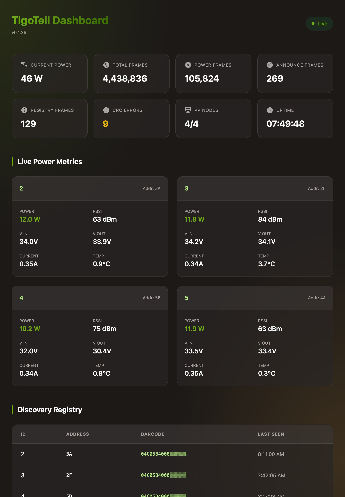

# TigoTell

**Tigo CCA/TAP sniffer built atop Waveshare ESP32-S3-RS485-CAN.**

Non-intrusively monitors communication between Tigo Cloud Connect Advanced (CCA) and Tigo Access Point (TAP) or solar modules to extract real-time telemetry data.

## 📸 Overview



**TigoTell** passively listens to the RS485 communication lines of your Tigo solar installation. By sniffing the packets exchanged between the CCA and the TAP, it decodes module-level power statistics, discovering nodes automatically without interfering with the proprietary network. This allows you to log fine-grained solar data into databases like InfluxDB while the official hardware remains unaware.

## ✨ Features

- **Passive Sniffing**  
  Safe, receive-only RS485 monitoring without disrupting existing communications.
- **Data Parsing**  
  Decodes Tigo essential frames (Voltage, Current, Temperature, Duty Cycle, RSSI, etc.).
- ️**Runtime Configuration**  
  Configure hardware pins, InfluxDB details, and reporting intervals via Web UI.
- **InfluxDB Integration**  
  Streams parsed telemetry directly to an InfluxDB instance over UDP line-protocol.
- ️**REST APIs**  
  Live JSON endpoints for power data, system discovery statistics, and parser health.
- **WebSerial Debugging**  
  Built-in web-based serial console.
- **OTA Updates**  
  Fast and secure Over-The-Air firmware updates using ElegantOTA.
- **WiFi Management**  
  AP-based initial setup for seamless network provisioning utilizing NetWizard.

## 📋 Requirements

### Hardware

- **Base Board**  
  Waveshare ESP32-S3-RS485-CAN (or a comparable ESP32-S3 board with an RS485 transceiver).
- **Communications Wiring**  
  Connection to the RS485 A and B lines between the Tigo CCA and TAP.
- **Power**  
  Can usually be run off the same power supply as the Tigo CCA.

### Software / Dependencies

- [pioarduino](https://github.com/pioarduino/platform-espressif32) Core (CLI) or VSCode IDE extension.
- _(Optional)_ An **InfluxDB** and/or **Telegraf** instance (configured to receive UDP datagrams) if you wish to record time-series metrics.

## 🚀 Getting Started

### Installation

#### Option 1: One-Click Install (Easiest)

If you have a Chrome-based browser (Chrome, Edge, Opera), you can flash TigoTell directly from your browser. This will install the firmware and filesystem in one go.

1.  Connect your Waveshare board to your computer via USB.
2.  Use a web flasher, such as the one hosted by ESPHome:

    [**⚡ Install TigoTell (Web Flasher)**](https://web.esphome.io/?manifest=https://github.com/gongloo/TigoTell/releases/latest/download/manifest.json)

3.  Select your device's COM port and follow the prompts.

---

#### Option 2: Manual Flash (via Browser)

If you prefer to flash files individually:

1.  Download `tigotell-factory.bin` from the **[Latest Release](https://github.com/gongloo/TigoTell/releases/latest)**.
2.  Go to **[web.esphome.io](https://web.esphome.io/)** or **[Adafruit WebSerial ESPTool](https://adafruit.github.io/Adafruit_WebSerial_ESPTool/)**.
3.  Flash **`tigotell-factory.bin`** to offset **`0x0`**. (This single file contains the bootloader, partitions, firmware, and filesystem).

_(If you chose to download `firmware.bin` and `littlefs.bin` separately, use offsets `0x10000` and `0xc90000` respectively.)_

---

#### Option 3: Build and Flash (CLI)

If you prefer to build from source using **pioarduino** or **PlatformIO**:

No manual configuration of source files is required for the initial build. Hardware settings (GPIO pins), InfluxDB details, and reporting intervals are handled dynamically via the **Web Dashboard** after deployment.

Use **pioarduino** or **PlatformIO** to compile and flash the firmware via USB:

1. **Clone the repository**:

   ```bash
   git clone https://github.com/gongloo/TigoTell.git
   cd TigoTell
   ```

2. **Flash via USB**:

   ```bash
   # Build and upload the firmware
   pio run -e esp32-s3-devkitm-1 -t upload

   # Build and upload the filesystem (LittleFS)
   pio run -e esp32-s3-devkitm-1 -t uploadfs
   ```

#### Optional: OTA Configuration

If you wish to upload updates over your local network using PlatformIO:

1. Provision your device with WiFi credentials and **set your OTA username/password via the Web UI**.
2. **Create the upload configuration**:
   ```bash
   cp platformio_upload.example.ini platformio_upload.ini
   ```
3. **Edit `platformio_upload.ini`**: Update `custom_upload_url` with your device's IP or mDNS address (e.g., `http://tigotell.local/update`), and set the `custom_username` and `custom_password` to match what you have configured in the Web UI.

### Network Provisioning

1. Once flashed, the ESP32 will broadcast a WiFi Access Point named `TigoTell`.
2. Connect to this network on your phone or computer.
3. A captive portal should appear (or navigate to `192.168.4.1`).
4. Enter your local WiFi credentials to connect the device to your network.

### Usage

Once connected to your local network, you can access the device in your browser via mdns (`http://TigoTell.local`) or its assigned IP address.

- **Settings**: Click the **Cog Icon** on the dashboard to configure Hardware Pins (TX, RX, EN), InfluxDB host/port, and reporting intervals.
- **`/json`**: Returns a snapshot of all discovered nodes and their latest parsed data, including system stats.
- **`/version`**: Returns the current firmware version and build timestamp.
- **`/update`**: Access the ElegantOTA firmware update portal, if enabled.
- **`/webserial`**: View live serial log output.

## 🙏 Credits & Acknowledgments

This project stands on the shoulders of the incredible reverse-engineering work done by the community. A massive thank you to the following projects which provided the foundation for decoding the Tigo protocols:

- **[willglynn/taptap](https://github.com/willglynn/taptap)**: Excellent documentation and implementation of the Tigo wireless protocol.
- **[tictactom/tigo_server](https://github.com/tictactom/tigo_server)**: Fundamental research and parsing logic for the Tigo CCA/TAP communications.
- **Google Gemini**: For AI pair-programming assistance in building and structuring this project!
- **[Google Material Design Icons](https://fonts.google.com/icons)**: Used for the web dashboard visualization (licensed under the Apache License 2.0).
